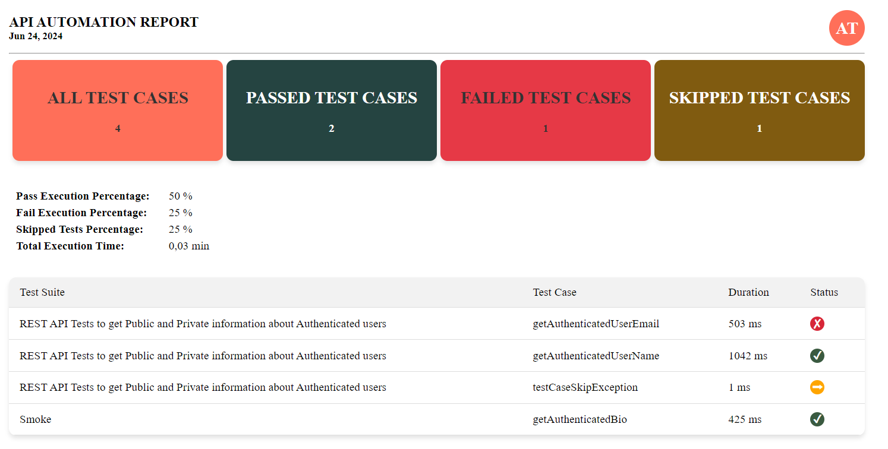

### Automate-OAuth2.0-with-GitHub
This project illustrates how to automate RESTful APIs securely using Java, TestNG, and Rest Assured. The main goal is to incorporate secure communication with GitHub resources into the automation testing project by integrating OAuth 2.0 authentication from GitHub.
#### Use Cases
OAuth 2.0 is to manage resources securely, in this case, particularly when interacting with GitHub resources(APIs). OAuth 2.0 allow my portfolio (http://aneletom.fun/) to gain limited access to GitHub resources without exposing credentials. This is just for testing purposes

#### Features
1. **GitHub OAuth 2.0 integration:** I am going to use GitHub OAuth 2.0 as an authorization mechanism and utilize GitHub API.
2. **Rest Assured automation:** Is an open library used with Java. It uses DSL to simplify automated tests for RESTful API's.
3. **Custom Reporting:**  Generates reports based on TestNG artifacts to provide detailed insights into test execution.

#### Technologies used:

1. Java
2. Rest assured
3. Selenium Webdrivers
4. TestNG
5. Custom Reporting tool, based on TestNg Artefacts
6. GitHub OAuth 2.0
7. Some GitHub API resources(scope)
8. Log4j2
9. DriverManager

#### Documentation:
https://docs.github.com/en/rest/users/users?apiVersion=2022-11-28

https://docs.github.com/en/rest/repos/repos?apiVersion=2022-11-28

#### Custom Reporting layout:

### Rendered Report information:

#### Report is build using:
1. Html and css: For the structure and styling
2. A bit of Javascript: For interaction with web elements
3. Handlebars Template: For templating.
4. TestNG IReporter interface: For appending data

#### Configuration
1. Set up GitHub OAuth 2.0 credentials and update the configuration file with the required details.
2. Modify the src/test/resources/config.properties file with your GitHub OAuth 2.0 credentials and other necessary configuration settings.

#### Contributing
Contributions are welcome! Please fork the repository and submit a pull request for any enhancements or bug fixes.

#### License
This project is licensed under the MIT License. See the LICENSE file for more details.

#### Contact for more info:
1. Anele Tom
2. aneletom10@gmail.com
