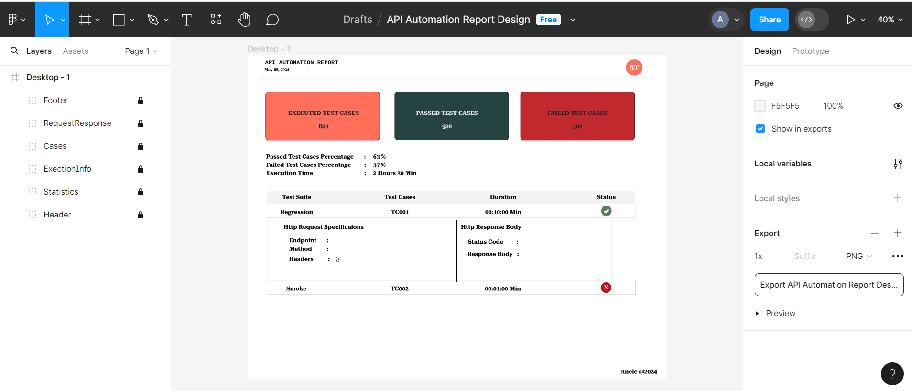

### Automate-OAuth2.0-with-GitHub
The project aims to demonstrate secure API testing using Rest Assured, Java and TestNG for RESTful API automation, with GitHub OAuth 2.0 authentication, by integrating GitHub OAuth 2.0 authentication into the testing project.

### Use Cases
OAuth 2.0 is to manage resources securely, in this case, particularly when interacting with GitHub resources(APIs). OAuth 2.0 allow my portfolio (http://aneletom.fun/) to gain limited access to GitHub resources without exposing credentials. This is just for testing purposes

### This Project Will Feature
1. **GitHub OAuth 2.0 integration:** I am going to use GitHub OAuth 2.0 as an authorization mechanism and utilize GitHub API.
2. **Rest Assured automation:** Is an open library used with Java. It uses DSL to simplify automated tests for RESTful API's

### Technologies used:

1. Java
2. Rest assured
3. Selenium Webdrivers
4. TestNG
5. Custom Reporting tool, based on TestNg Artefacts
6. GitHub OAuth 2.0
7. Some GitHub API resources(scope)
8. Log4j2
9. DriverManager

### Documentation:
https://docs.github.com/en/rest/users/users?apiVersion=2022-11-28
https://docs.github.com/en/rest/repos/repos?apiVersion=2022-11-28

### Custom Reporting layout:

### Will be building using:
1. Html and css.
2. A bit of Javascript.
3. VueJS or Handlebars Template for templating.
4. TestNG IReporter interface for appending data